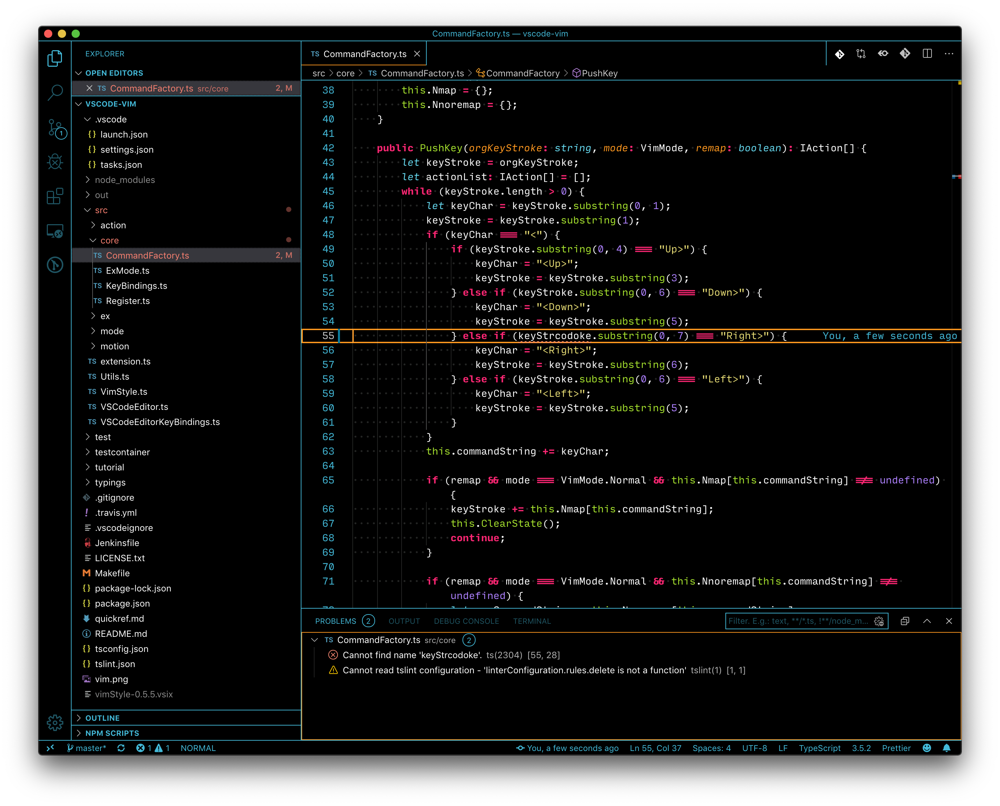

# Monokai Charcoal with high contrast for vscode theme

- based on [Monokai Charcoal](https://colorsublime.github.io/themes/Monokai%20Charcoal/)
- some arranged color
- available some frame color



Recommended File Icon Theme: [High Contrast Icons](https://marketplace.visualstudio.com/items?itemName=74th.high-contrast-icons)

## colors

### blue (default)


## gray


## green


## orange


## purple


## red


## white


## yellow


## for vim


## how to use

```
cd ~/.vscode/extensions/
git clone git@github.com:74th/vscode-monokaicharcoal.git
```

restart VSCode and change the theme to monokai-charcoal(HC)
